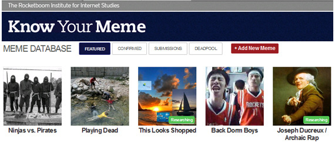
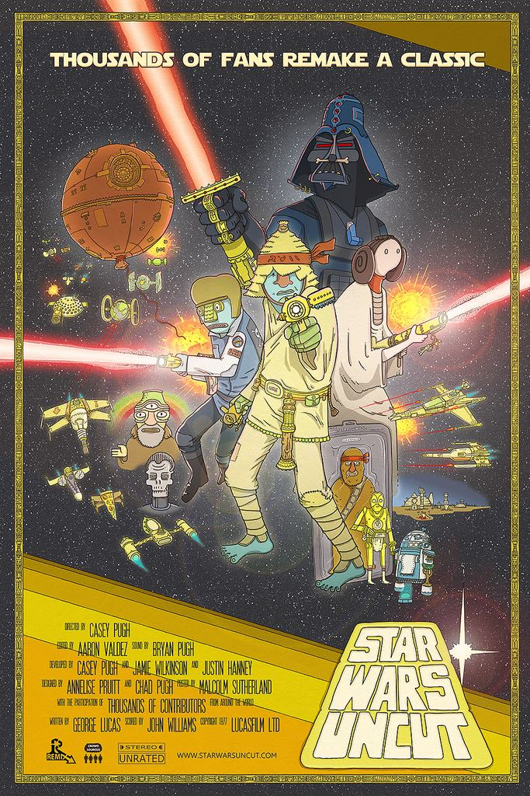
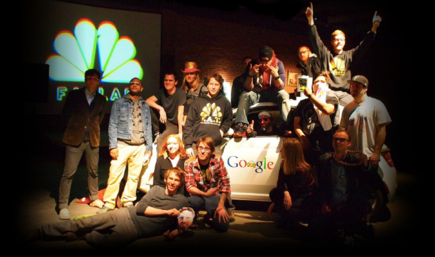
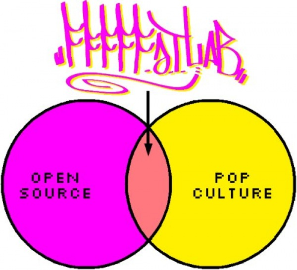

<h1>Jamie "Dubs" Wilkinson</h1>

I am an American computer programmer and entrepreneur.

Here is an awkward interview with me:

  <iframe src="https://player.vimeo.com/video/172932512?title=0" width="640" height="360" frameborder="0" webkitallowfullscreen mozallowfullscreen allowfullscreen></iframe>

  I'm currently available for consulting and investment opportunities.
  <!-- TODO what I'm looking for -->

  Contact me: <a href="http://twitter.com/jamiew">@jamiew</a> on Twitter
  or email "jamie@<i>[[thisdomain]]</i>.com"

  Sign up for my email newsletter, sent a few times per year (max)
  <form action="https://tinyletter.com/jamiedubs" method="post" target="popupwindow" onsubmit="window.open('https://tinyletter.com/jamiedubs', 'popupwindow', 'scrollbars=yes,width=800,height=600'); return true">
    <input type="text" style="width: 340px" name="email" id="tlemail" />
    <input type="hidden" value="1" name="embed"/>
    <input type="submit" value="Subscribe" />
  </form>



  I am (@jamiew)[https://github.com/jamiew] on GitHub
  and here is (my PGP public key)[/pgp-public-key.txt]

  <!-- TODO things I'm learning about
      tutors I'm looking for
      subjects I can teach
      /mentorship -->

  I am currently...
  I am available for consulting and investment opportunities.
  I'm looking for: blockchain & distributed system tutors
  I'm currently learning about distributed systems and blockchains
  Interests: healthcare, security, machine learning,
  DIY home media centers



  From 2010-2018 I was the co-founder and CEO of <a href="https://en.wikipedia.org/wiki/VHX">VHX</a>,
  a platform for selling movies and TV shows directly to fans.
  In 2017 we were <a href="http://www.theverge.com/2016/5/2/11554434/vimeo-acquires-vhx">acquired by Vimeo</a>,
  and the product is now known as <a href="https://ott.vimeo.com/">Vimeo OTT</a>.
  We had the privilege of working with thousands of small businesses as well as well-known artists like Dave Grohl, Kevin Hart, This American Life, Grace Helbig and more.
  The company was backed by investors like Union Square Ventures, Comcast Ventures, Lerer Ventures, Chris Sacca, Alexis Ohanian and more.

  After VHX and Vimeo I served as the Chief Product Officer at <a href="https://www.kickstarter.com">Kickstarter</a>,
  where I led product, data and engineering.

  In 2008, I helped create <a href="http://knowyourmeme.com">Know Your Meme</a>,
  a community-edited database of Internet culture (like Wikipedia).
  We also produced a web show where we would dress up in lab coats and explain the stories behind notable memes.
  Some of my favorite episodes are embedded below.
  The site was acquired by the Cheezburger Network in 2011, and remains a popular destination for anyone trying to understand an obscure reference.

<!--
-->

<!--
-->

In 2010 I won a Primetime Emmy for my work on <a href="http://starwarsuncut.com">Star Wars Uncut</a>,
  where we chopped the original Star Wars movie into 15 second pieces and invited the Internet
  to recreate them, one scene at a time. The project was created by
  <a href="http://caseypugh.com">Casey Pugh</a>, my co-founder at VHX.

From 2007 to 2016 I was a member of the <a href="http://fffff.at">FAT Lab (Free Art & Technology)</a>,
 a group of artists, hackers, and activists "releasing early, often and w/ rap music."

I contributed to lots of small and large projects, all released as open-source, including
 <a href="http://graffitimarkuplanguage.com">Graffiti Markup Language</a>,
 <a href="http://jamiedubs.com/google-alarm">Google Alarm</a>,
 <a href="https://web.archive.org/web/20130720124322/internetfamo.us/class">Internet Famous Class</a>,
 <a href="http://occupyinter.net">occupyinter.net</a>,
 <a href="https://github.com/jamiew/fuckflickr">FuckFlickr</a>,
 <a href="https://twitter.com/kanyerants">The Kanye Rant Detector</a>,
 and <a href="http://fffff.at/author/jamie">many more</a>.

Here's the crew with the fake Google Street View car we built in 2015:

<!--

I taught the Internet Famous Class at Parsons New School in 2007-2008,
where students grades depended on generating Internet traffic.

-->

<!--
My blog is <a href="http://jamiew.tumblr.com">jamiew.tumblr.com</a>-->

I love open-source software and publish as much code as possible on <a href="https://github.com/jamiew">github.com/jamiew</a>

<!--

-->

Here is an incomplete list of other projects:

<ul>
<li><a href="http://fffff.at/scratchml-data-spec/">Scratch Markup Language (ScratchML)</a> (2012)
<li><a href="/googlealarm">Google Alarm</a> (2010)
<li><a href="http://occupyinter.net">Occupy Internet</a> (2010)
<li><a href="http://graffitimarkuplanguage.com">Graffiti Markup Language (GML)</a> (2010)
<li><a href="/jsonview-chrome">JSONView for Chrome</a> (2010)
<li><a href="http://000book.com">000000book</a> (2009)
<li><a href="/canvasplayer">Canvasplayer</a> (2009)
<li><a href="/quotable-kanye">Quotable Kanye</a> (2009)
<li><a href="/kanyestudio-pro">Kanye Studio Pro</a> (2009)
<li><a href="/KANYERANTS">Kanye Rant Detector</a> (2009)
<li><a href="/meme-breaks">Meme Breaks</a> (2008)
<li><a href="https://vimeo.com/2177573">Obama Wikipedia page edits</a> (2008)
<li><a href="http://internetfamo.us">Internet Famous Class</a> (2007-2008)
<li><a href="http://rickrolldb.com">Rickroll Database</a> (2007)
<li><a href="http://fuckflickr.com">FuckFlickr</a> (2007)
<li><a href="/big-rip">BIG_RIP.js</a> (2007)
<li><a href="/breakout-usa">Breakout USA</a> (2007)
<li><a href="/matrixmaker">Product Management Approval Matrix</a> (2007)
</ul>


* <a href="http://fffff.at/scratchml-data-spec/">Scratch Markup Language (ScratchML)</a> (2012)
  - digitizing turntablism
  - see also Graffiti Markup Language (.gml)
* <a href="/googlealarm">Google Alarm</a> (2010)
    - browser extension that loudly alerts you whenever you're sending data to Google
    - <a href="http://fffff.at/google-alarm/">blog post</a>
* <a href="http://occupyinter.net">Occupy Internet</a> (2010)
    - animated GIF protestors for your website
    - join the global revolution from the comfort of your own home
    - <a href="">blog post</a>
* <a href="/meme-breaks">Meme Breaks</a> (2008)
  - scratch your favorite Internet memes
  - <a href="http://fffff.at/scratch-my-internet-memes/">blog post</a>
* <a href="http://graffitimarkuplanguage.com">Graffiti Markup Language (GML)</a>
  - file format for capturing and replaying graffiti tags
* <a href="http://000book.com">000000book</a> (2009)
    - open database for Graffiti Markup Language (.gml) files
* <a href="/canvasplayer">Canvasplayer</a> (2009)
    - draw GML using processing.js - <a href="http://fffff.at/canvasplayer-draw-gml-with-javascript/">blog post</a> - <a href="https://github.com/jamiew/canvasplayer/">source code</a>
* <a href="https://vimeo.com/2177573">Obama Wikipedia page edits</a> (2008)
    - visualizes contributors to the Obama page over time
    - <a href="http://fffff.at/visualizing-obama-wikipedia-page-edits/">blog post</a>
* <a href="http://internetfamo.us">Internet Famous Class</a> (2007-2008)
    - I taught a graduate course at Parsons Design & Technology program where student grades were based on how many views and likes they could generate
* <a href="http://rickrolldb.com">Rickroll Database</a> (2007)
    - AdBlock filter for rickrolls
    - you're welcome
* <a href="/jsonview-chrome">JSONView for Chrome</a> (2010)
    - browser extension for
    - <a href="https://github.com/jamiew/jsonview-chrome">source code</a>
* <a href="http://fuckflickr.com">FuckFlickr</a> (2007)
    - host your own photos
    - <a href="https://github.com/jamiew/fuckflickr">source code</a>
<!-- Kanye Week -->
* <a href="/KANYERANTS">Kanye Rant Detector</a> (2009)
  - alerts you when Kanye is using ALLCAPS on his blog
  - <a href="http://fffff.at/kanye-rant-detector/">blog post</a>
* <a href="/quotable-kanye">Quotable Kanye</a> (2009)
  - Yeezy wisdom (with API)
  - <a href="http://fffff.at/quotable-kanye/">blog post</a>
* <a href="/kanyestudio-pro">Kanye Studio Pro</a> (2009)
* <a href="/big-rip">BIG_RIP.js</a> (2007)
* <a href="/breakout-usa">Breakout USA</a> (2007)
* <a href="/matrixmaker">Product Management Approval Matrix</a>
<!--
* ghettovision https://github.com/jamiew/ghettovision
* eBay Spells & Potions  https://github.com/jamiew/ebay-spells
* FAT Lab 4chan takeover (date?) https://github.com/jamiew/fatchan
* wikiswarm (Obama Wikipedia page edits)
* Storyboard w/ bennett
* $6 for free
* filemark maker
* <a href="/musicblackhole">Music Blackhole</a> (2007)</li>
-->
<!-- contributed to -->
<!--
* whytheyhate.us
* Pirates of the Amazon
* White Glove Tracking https://github.com/jamiew/white-glove-tracking
-->
<!-- VHX 1.0 projects -->
<!--
* watchlater.org!
* UrbanTV
* <a href="/hypetv">HypeTV</a> (2011)</li>
* <a href="/localtv">LocalTV</a> (2011)</li>
-->
<!-- BeOS era -->
<!--
* BeNews
* Tave Imagination
* FolderIconMaker
 -->


Here are some more lists I'm working on:

• <a href="/press-mentions">List of press mentions</a>

• <a href="/exhibitions">List of exhibitions</a>

Here's some videos I've helped make:

<h1>Know Your Meme episodes (2007-2010)</h1>

<iframe width="560" height="315" src="https://www.youtube.com/embed/CRPTGlXFTu0?t=29&start=29" frameborder="0" allowfullscreen></iframe>

<iframe width="560" height="315" src="https://www.youtube.com/embed/K754RWX-AGM" frameborder="0" allowfullscreen></iframe>

<iframe width="560" height="315" src="https://www.youtube.com/embed/BQtffQC3gYE" frameborder="0" allowfullscreen></iframe>

<iframe width="560" height="315" src="https://www.youtube.com/embed/ps3MnbW8Erg" frameborder="0" allowfullscreen></iframe>

<!--<iframe width="560" height="315" src="https://www.youtube.com/embed/8HgrkA5XzrY" frameborder="0" allowfullscreen></iframe>-->

<h1>Star Wars Uncut (2010)</h1>

<iframe width="560" height="420" src="https://www.youtube.com/embed/7ezeYJUz-84" frameborder="0" allowfullscreen></iframe>

<strong>Empire Uncut (2015)</strong>

<iframe width="560" height="315" src="https://www.youtube.com/embed/GjsFAZWnA00?t=59&start=59" frameborder="0" allowfullscreen></iframe>

<h1>FAT Lab projects (2007-2015)</h1>

<strong>000000book - Graffiti Markup Language database (2010)</strong>

<iframe src="https://player.vimeo.com/video/8733607" width="640" height="360" frameborder="0" webkitallowfullscreen mozallowfullscreen allowfullscreen></iframe>

<strong>Occupyinter.net (2012)</strong>

<iframe src="https://player.vimeo.com/video/62976317" width="640" height="360" frameborder="0" webkitallowfullscreen mozallowfullscreen allowfullscreen></iframe>

<strong>Google Alarm (2010)</strong>

<iframe src="https://player.vimeo.com/video/13648673" width="640" height="360" frameborder="0" webkitallowfullscreen mozallowfullscreen allowfullscreen></iframe>

<strong><a href="/memebreaks">Meme Breaks</a> (2008)</strong>

<iframe src="https://player.vimeo.com/video/1734880" width="640" height="483" frameborder="0" webkitallowfullscreen mozallowfullscreen allowfullscreen></iframe>

<strong>Obama Wikipedia page edits (2008)</strong>

<iframe src="https://player.vimeo.com/video/2177573" width="640" height="360" frameborder="0" webkitallowfullscreen mozallowfullscreen allowfullscreen></iframe>

<strong>Hard Drive Bombs (2007)</strong>

<iframe src="https://player.vimeo.com/video/218891" width="640" height="480" frameborder="0" webkitallowfullscreen mozallowfullscreen allowfullscreen></iframe>

<h1>Talks/Presentations</h1>

<!-- LDV Vision summit 2015 -->
<!-- http://video.ldv.co/5dbD/jamie-wilkinson-ceo-of-vhxtv-will-global-monetization-and-distribution-of-content-be-disrupted-or-em/ -->

<strong>XOXO Festival (2012) - VHX</strong>

<iframe width="560" height="315" src="https://www.youtube.com/embed/rdSEbkdxvbg" frameborder="0" allowfullscreen></iframe>

<strong>Vimeo Festival (2011) - "Internet Fame, Easy as 1 2 3"</strong>

<iframe src="https://player.vimeo.com/video/19086114" width="640" height="360" frameborder="0" webkitallowfullscreen mozallowfullscreen allowfullscreen></iframe>

<!-- <strong>CNN - Google Alarm interview (2010)</strong> -->
<!-- https://vimeo.com/13863886 -->

<!-- ROFLCon Summit - Portland, OR - 2012? -->
<!-- https://vimeo.com/31705974 -->



<strong>Transmediale 2010 - Art 2.0 panel</strong>

<iframe src="https://transmediale.de/node/12626/video?width=620" width=620 height=491 frameborder=0 scrolling=no seamless=seamless></iframe>



<strong>TEDxSOMA (2010) - Google Alarm</strong>

<iframe width="560" height="315" src="https://www.youtube.com/embed/AInw9ZCytMg" frameborder="0" allowfullscreen></iframe>

<!-- Innovators on the Move (VHX) -->
<!-- https://vimeo.com/55383008 -->

<strong>Internet Famous Class on NBC (2008)</strong>

<iframe src="https://player.vimeo.com/video/838276" width="640" height="427" frameborder="0" webkitallowfullscreen mozallowfullscreen allowfullscreen></iframe>

<h1>VHX (2010-2017)</h1>

Animation & art direction by <a href="http://peprally.co/">Erica Gorochow</a>:

<iframe src="https://player.vimeo.com/video/55316707?color=18d6cf&byline=0&portrait=0" width="500" height="281" frameborder="0" webkitallowfullscreen mozallowfullscreen allowfullscreen></iframe>

Animations mostly by Kornhaber Brown with sound design by Mike Rugnetta and Bryan Pugh

<iframe src="https://player.vimeo.com/video/71056088?color=18d6cf&byline=0&portrait=0" width="500" height="281" frameborder="0" webkitallowfullscreen mozallowfullscreen allowfullscreen></iframe>



<iframe src="https://player.vimeo.com/video/24583232?color=18d6cf&byline=0&portrait=0" width="500" height="281" frameborder="0" webkitallowfullscreen mozallowfullscreen allowfullscreen></iframe>

<iframe src="https://player.vimeo.com/video/24583161?color=18d6cf&byline=0&portrait=0" width="500" height="281" frameborder="0" webkitallowfullscreen mozallowfullscreen allowfullscreen></iframe>

<iframe src="https://player.vimeo.com/video/24582913?color=18d6cf&byline=0&portrait=0" width="500" height="281" frameborder="0" webkitallowfullscreen mozallowfullscreen allowfullscreen></iframe>

<iframe src="https://player.vimeo.com/video/24529693?color=18d6cf&byline=0&portrait=0" width="500" height="281" frameborder="0" webkitallowfullscreen mozallowfullscreen allowfullscreen></iframe>

<iframe src="https://player.vimeo.com/video/24519351?color=18d6cf&byline=0&portrait=0" width="500" height="281" frameborder="0" webkitallowfullscreen mozallowfullscreen allowfullscreen></iframe>

<iframe src="https://player.vimeo.com/video/24481851?color=18d6cf&byline=0&portrait=0" width="500" height="283" frameborder="0" webkitallowfullscreen mozallowfullscreen allowfullscreen></iframe>

<iframe src="https://player.vimeo.com/video/24481734?color=18d6cf&byline=0&portrait=0" width="500" height="281" frameborder="0" webkitallowfullscreen mozallowfullscreen allowfullscreen></iframe>

<iframe src="https://player.vimeo.com/video/24481697?color=18d6cf&byline=0&portrait=0" width="500" height="283" frameborder="0" webkitallowfullscreen mozallowfullscreen allowfullscreen></iframe>

<iframe src="https://player.vimeo.com/video/24338690?color=18d6cf&byline=0&portrait=0" width="500" height="281" frameborder="0" webkitallowfullscreen mozallowfullscreen allowfullscreen></iframe>

